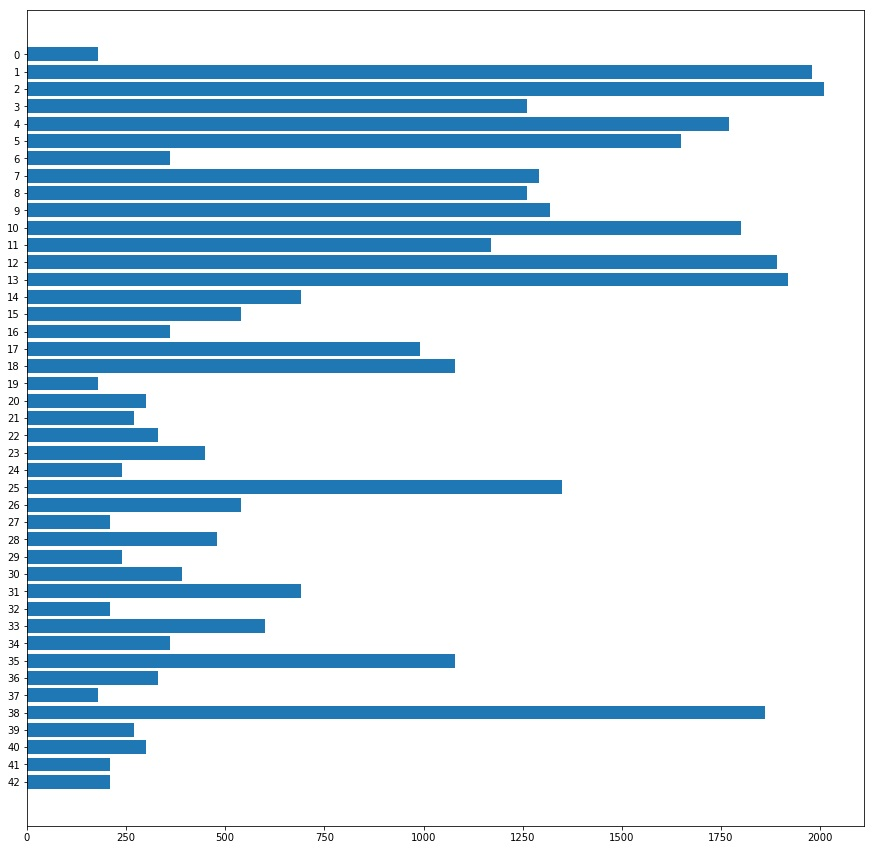
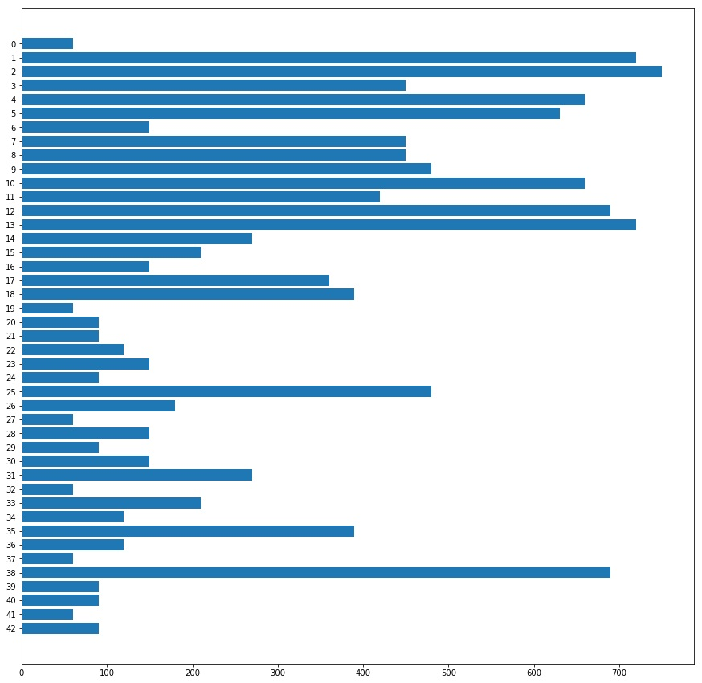
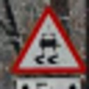
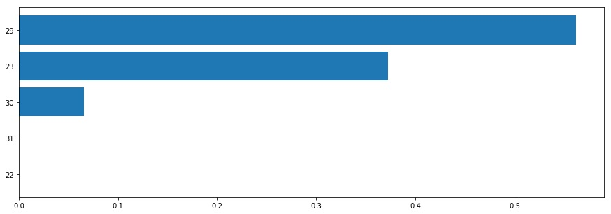
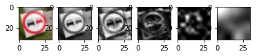

# **Traffic Sign Recognition**

Recognition and classification of traffic signs with help of Deep Learning algorithms

---

**Build a Traffic Sign Recognition Project**

The goals / steps of this project are the following:
* Load the data set (see below for links to the project data set)
* Explore, summarize and visualize the data set
* Design, train and test a model architecture
* Use the model to make predictions on new images
* Analyze the softmax probabilities of the new images
* Summarize the results with a written report

## Rubric Points
Here I will consider the [rubric points](https://review.udacity.com/#!/rubrics/481/view) individually and describe how I addressed each point in my implementation.  

---

### Writeup / README

#### 1. Provide a Writeup / README that includes all the rubric points and how you addressed each one

You're reading it! and here is a link to my [Traffic Sign Recognition project](https://github.com/mcounter/TrafficSignClassifier).

### Data Set Summary & Exploration

#### 1. Provide a basic summary of the data set

To calculate base data statistic I used standard NumPy functions.
Results are:

* The size of training set is **34'799** samples
* The size of the validation set is **4'410** samples
* The size of test set is **12'630** samples
* The shape of a traffic sign image is **(32, 32, 3)**
* The number of unique classes/labels in the data set is **43**

#### 2. Include an exploratory visualization of the dataset

##### **Training data**
Here is an exploratory visualization of the training data set. The horizontal bar chart showing number of samples in the training set by axis X and class Id (0 - 42) by axis Y.

**Details**

| Class | Description | Number of samples
|:-----:|:-----------:|:-----------------:
|  0 | Speed limit (20km/h) | 180
|  1 | Speed limit (30km/h) | 1980
|  2 | Speed limit (50km/h) | 2010
|  3 | Speed limit (60km/h) | 1260
|  4 | Speed limit (70km/h) | 1770
|  5 | Speed limit (80km/h) | 1650
|  6 | End of speed limit (80km/h) | 360
|  7 | Speed limit (100km/h) | 1290
|  8 | Speed limit (120km/h) | 1260
|  9 | No passing | 1320
| 10 | No passing for vehicles over 3.5 metric tons | 1800
| 11 | Right-of-way at the next intersection | 1170
| 12 | Priority road | 1890
| 13 | Yield | 1920
| 14 | Stop | 690
| 15 | No vehicles | 540
| 16 | Vehicles over 3.5 metric tons prohibited | 360
| 17 | No entry | 990
| 18 | General caution | 1080
| 19 | Dangerous curve to the left | 180
| 20 | Dangerous curve to the right | 300
| 21 | Double curve | 270
| 22 | Bumpy road | 330
| 23 | Slippery road | 450
| 24 | Road narrows on the right | 240
| 25 | Road work | 1350
| 26 | Traffic signals | 540
| 27 | Pedestrians | 210
| 28 | Children crossing | 480
| 29 | Bicycles crossing | 240
| 30 | Beware of ice/snow | 390
| 31 | Wild animals crossing | 690
| 32 | End of all speed and passing limits | 210
| 33 | Turn right ahead | 599
| 34 | Turn left ahead | 360
| 35 | Ahead only | 1080
| 36 | Go straight or right | 330
| 37 | Go straight or left | 180
| 38 | Keep right | 1860
| 39 | Keep left | 270
| 40 | Roundabout mandatory | 300
| 41 | End of no passing | 210
| 42 | End of no passing by vehicles over 3.5 metric tons | 210

**Conclusion**
Training data set is not equally distributed. Some classes have in 10+ times more examples than other. As result, these classes will be much better trained than other. And model will prone to false positive recognitions of these classes.

Training set must be augmented to have equal number of samples for each class.

##### **Validation data**
Here is an exploratory visualization of the validation data set. The horizontal bar chart showing number of samples in the validation set by axis X and class Id (0 - 42) by axis Y.

**Details**

| Class | Description | Number of samples
|:-----:|:-----------:|:-----------------:
|  0 | Speed limit (20km/h) | 30
|  1 | Speed limit (30km/h) | 240
|  2 | Speed limit (50km/h) | 240
|  3 | Speed limit (60km/h) | 150
|  4 | Speed limit (70km/h) | 210
|  5 | Speed limit (80km/h) | 210
|  6 | End of speed limit (80km/h) | 60
|  7 | Speed limit (100km/h) | 150
|  8 | Speed limit (120km/h) | 150
|  9 | No passing | 150
| 10 | No passing for vehicles over 3.5 metric tons | 210
| 11 | Right-of-way at the next intersection | 150
| 12 | Priority road | 210
| 13 | Yield | 240
| 14 | Stop | 90
| 15 | No vehicles | 90
| 16 | Vehicles over 3.5 metric tons prohibited | 60
| 17 | No entry | 120
| 18 | General caution | 120
| 19 | Dangerous curve to the left | 30
| 20 | Dangerous curve to the right | 60
| 21 | Double curve | 60
| 22 | Bumpy road | 60
| 23 | Slippery road | 60
| 24 | Road narrows on the right | 30
| 25 | Road work | 150
| 26 | Traffic signals | 60
| 27 | Pedestrians | 30
| 28 | Children crossing | 60
| 29 | Bicycles crossing | 30
| 30 | Beware of ice/snow | 60
| 31 | Wild animals crossing | 90
| 32 | End of all speed and passing limits | 30
| 33 | Turn right ahead | 90
| 34 | Turn left ahead | 60
| 35 | Ahead only | 120
| 36 | Go straight or right | 60
| 37 | Go straight or left | 30
| 38 | Keep right | 210
| 39 | Keep left | 30
| 40 | Roundabout mandatory | 60
| 41 | End of no passing | 30
| 42 | End of no passing by vehicles over 3.5 metric tons | 30

**Conclusion**
Validation data set is not well distributed as training set. Validation set is not involved in model training intensively. It's just used to recognize when model accuracy become decrease. Artificially augmentation of this data set must not have significant effect, just slowdown training process.

Validation set can remain as is. But accuracy (plausibility) of calculated model performance, precision and recall will be higher for classes with more samples in validation set.

##### **Testing data**
Here is an exploratory visualization of the testing data set. The horizontal bar chart showing number of samples in the testing set by axis X and class Id (0 - 42) by axis Y.

**Details**

| Class | Description | Number of samples
|:-----:|:-----------:|:-----------------:
|  0 | Speed limit (20km/h) | 60
|  1 | Speed limit (30km/h) | 720
|  2 | Speed limit (50km/h) | 750
|  3 | Speed limit (60km/h) | 450
|  4 | Speed limit (70km/h) | 660
|  5 | Speed limit (80km/h) | 630
|  6 | End of speed limit (80km/h) | 150
|  7 | Speed limit (100km/h) | 450
|  8 | Speed limit (120km/h) | 450
|  9 | No passing | 480
| 10 | No passing for vehicles over 3.5 metric tons | 660
| 11 | Right-of-way at the next intersection | 420
| 12 | Priority road | 690
| 13 | Yield | 720
| 14 | Stop | 270
| 15 | No vehicles | 210
| 16 | Vehicles over 3.5 metric tons prohibited | 150
| 17 | No entry | 360
| 18 | General caution | 390
| 19 | Dangerous curve to the left | 60
| 20 | Dangerous curve to the right | 90
| 21 | Double curve | 90
| 22 | Bumpy road | 120
| 23 | Slippery road | 150
| 24 | Road narrows on the right | 90
| 25 | Road work | 480
| 26 | Traffic signals | 180
| 27 | Pedestrians | 60
| 28 | Children crossing | 150
| 29 | Bicycles crossing | 90
| 30 | Beware of ice/snow | 150
| 31 | Wild animals crossing | 270
| 32 | End of all speed and passing limits | 60
| 33 | Turn right ahead | 210
| 34 | Turn left ahead | 120
| 35 | Ahead only | 390
| 36 | Go straight or right | 120
| 37 | Go straight or left | 60
| 38 | Keep right | 690
| 39 | Keep left | 90
| 40 | Roundabout mandatory | 90
| 41 | End of no passing | 60
| 42 | End of no passing by vehicles over 3.5 metric tons | 90

**Conclusion**
Testing data set is not well distributed as both training and validations sets. Training set is used for final model testing to estimate performance of resulting model.

As in case of validation set, accuracy (plausibility) of calculated model performance, precision and recall will be higher for classes with more samples in testing set. The main problem not distribution of examples, but absolute number of samples in training and testing sets. Small number of samples cause problem when some important examples from testing set was not included in training set at all and artificial transformation of original images don't resolve this problem.

### Design and Test a Model Architecture

#### 1. Describe how you preprocessed the image data

To understand what data present in data set, I exported all images on disk and analyzed it:
* Significant part of images was either too dark or too bright. On the first glance it must not be a huge problem. Convolution operators are used for edge detection and can work with too dark or bright images. But on practice it requires trained model having more parameters. And more data is required to train such models. To achieve more predictable results, I decided normalize images.
* The other thing I discovered, color is not significant for signs recognition, because lighting conditions can be too different and colors of same sign can vary in significant measures. Moreover much signs have same colors, but different notions inside. I decided grayscale images.
* After normalizing I figured out, that some images have parts with huge intensity in comparison with other image parts. It can be reflection of sun or flash or car lights, etc. To avoid this problem I decided normalize local image histograms with help of Contrast Limited Adaptive Histogram Equalization (CLAHE) method. I used appropriate OpenCV function createCLAHE() to create filter with parameters clipLimit = 40 and timeGridSize = (4, 4). After that applied filters on all images.

Here is examples:

| Original  image | Grayscaled  and  normalized | Histogram  correction with  CLAHE
|:------------------:|:---------------------------------:|:---------------------------------------:
|  |  | 

You can see, that final image is very contrast and has much details. Probably too much in some cases. In comparison with just grayscaled and normalized image, model trained on images with histogram correction had almost the same performance. But incorrectly-recognized images were different. That's why I decided use both and put it on different image channels.

**So, my model uses images with 2 channels: first - grayscaled and normalized image, second - same image but additionally processed with CLAHE.**

##### 1.1 Training set equalization and augmentation

As was described above, training set has very different number of samples per each class. Moreover each traffic sign can have different size, position and orientation on the training image. Good idea extend existing training set with more data to learn model recognize same sign with different scale and orientation.

To do that I augmented training set with next transformations of randomly selected signs:
* Random rotation on [-30, 30] degrees around randomly selected point between [1/3, 2/3] of image width and height.
* Random scaling on [0, 30] percents up or down.

This affine transformation was implemented with help of warpAffine() OpenCV function. Border mode BORDER_REFLECT was selected as optimal, because don't produce sharp image changes and don't force convolution operators detect unnecessary edges.

Image translation was not used by 2 reasons:
* It's not possible implement it with help of same warpAffine() OpenCV function without additional matrix calculations. Using of separate operators augments borders twice and it produces more noise.
* Rotation around randomly selected point (not image center) is equal to translation and rotation around a center, so separate translation will not have much effect.

Image reflection was not used as well, because signs always readable in one direction and reflected images must be rejected. But image rejection is out of this task scope.

Here is examples of transformed images:

Each transformed image is preprocessed in the same way as original.

Sure, transformed images cannot substitute real examples, but it's good approach when dataset is limited.

Number of examples was selected to make total training set size 2'500 samples per each sign. Experiments showed, that increasing of this values caused negative effect. I think it's related to many duplicates appear - original image has small size and transformations with similar parameters produce same output.

##### 1.2 Memory problem

Augmented data requires much more memory to store training set. Real problem appear when I approached to 4Gb limit. Despite of 64 bit architecture, teaching model on such data volumes caused unrecovered crash.

To make possible teach models on any data volumes, I developed a special framework. It required rework everything on classes. But model teaching become predictable in memory consumption and not limited by amount of teaching data.

The idea is simple: pre-processed data is stored on disk in separate folder called *data storage*. Whole data set split on files, which can be loaded in memory at once (approximately 1Gb each, but this is adjustable parameter). System loads files one-by one in random order and used it in teaching process.

There are several important technical condition which makes this approach possible:
* Data must have normal random distribution across ALL files in data storage.
* Number of samples in each file must be much bigger than number of classes and files (1000 times or more).
* Location of data storage must be local to avoid long downloading process each time file is used.

#### 2. Describe what your final model architecture looks like including model type, layers, layer sizes, connectivity, etc.)

My final model consisted of the following layers:

| Layer | Description |
|:-----:|:-----------:|
| Input | 32x32x2 - two channels:  1) Grayscaled normalized image  2) Grayscaled normalized image with CLAHE |
| Convolution 3x3 | 1x1 stride, VALID padding, outputs 30x30x32 |
| ReLU |  |
| AVG pooling	2x2 | 2x2 stride, outputs 15x15x32 |
| Convolution 4x4 | 1x1 stride, VALID padding, outputs 12x12x48 |
| ReLU |  |
| AVG pooling	2x2 | 2x2 stride, outputs 6x6x48 |
| Convolution 3x3 | 1x1 stride, VALID padding, outputs 4x4x64 |
| ReLU |  |
| Dropout | Probability of dropout 50% |
| Fully connected	| 1024x300 |
| ReLU |  |
| Dropout | Probability of dropout 50% |
| Fully connected	| 300x200 |
| ReLU |  |
| Dropout | Probability of dropout 50% |
| Output layer | 200x43 (number of classes) |
| Softmax | 	|
| Model loss | Model loss is calculated as sum of Cross-entropy averaged by whole training batch and L2-loss calculated for each weight in fully-connected layers and multiplied by fixed regularization factor	|

Dropouts was used between fully-connected layers and after last convolutional layers. Any dropouts between convolutional layers decreased model performance, so it was not used at all.

#### 3. Describe how you trained your model

To train model adaptive gradient-based Adam optimizer with dropouts was used. This algorithm uses adaptively estimated moments and allow teach model more smoothly than simple gradient descent. Moreover it's included in TensorFlow and can be easy used with standard parameters.

Global optimization parameters:

| Parameter | Value |
|:---------:|:-----:|
| Batch size | 128 |
| Rounds | 3 |
| Epochs | 75 |
| Learning rate | From 0.003 to 0.0005 exponentially |
| Regularization  factor | 0.0001 |
| Dropout  probability  (full-connected) | 50% |
| Dropout  probability  (convolutional) | not used |
| Training dataset | 2'500 per class  Same, but shuffled for each epoch |
| Normal distribution  for inital data | Mean = 0.0  Sigma = 0.1 |

Almost all parameters was selected empirical, after set of experiments.

Models training cycle contains several rounds with fixed number of epochs. At the end of each epoch model performance is validated on validation set, model with best performance is saved as final result. First round is started from normally distributed random data with **mean 0.0** and **sigma 0.1**. Each next round is started from last best model. Learning rates for each round are started from the same value for epoch 1 and exponentially decreased for each next epoch.

There is no early termination of learning process, just model selection based on validation set performance. Using dropouts prevents model from overfitting.

#### 4. Describe the approach taken for finding a solution

I started my investigations from standard LeNet model with 2 convolutional layers, 2 fully-connected and one output layer. Model was modified a bit to accept RGB images.

On initial training set this model hardly reached 90% performance. After that I was iteratively changing model architecture and pre-processing methods:
* I grayscaled and normalized image instead of using RGB format. It allowed decrease number of model parameters and increase it performance.
* I changed model depth - proportional increasing number of channels on convolutional layers and fully-connected layers. It increased number of model parameters quadratically and allowed train models better. Adding model depth as parameter allowed easy try different models with one parameter change. Practically it's not efficient increase model depth in wide ranges, so I tried models with depths from 1 to 3.
* I tried to increase number of fully-connected layers, but performance was not improved.
* Max pooling was replaced by average pooling, which demonstrated better performance.
* Next idea was increase number of convolutional layers. But it was not such straightforward tasks as may appear. Small size of inbound image don't allow add much layers. Moreover parameters of each layer must be consistent to avoid side effects. After some experiments final model contained 3 convolutional layers with 3x3, 4x4 and 3x3 filter size and VALID padding, 2 average 2x2 pooling with 2x2 stride after first 2 layers. Using 5x5 convolutional filters in first layer probably fine for letters recognition tasks, but it seems too much for sign recognition task, where much more information present in same image size and need more accurate processing. Second convolutional layer have unusual size 4x4 to have output image size 12x12 (even numbers) and avoid side effects in next pooling operator.
* L2-loss regularization was added for each weight matrix in fully-connected layer to do learning process more smooth and avoid CNN to be paralyzed.
* Finally dropouts was added to avoid model overfitting. Dropouts was added between fully-connected layers. Adding  dropouts between convolutional layers decreased model performance. I think that is expected behavior, especially for small inbound images. Convolutional operators are used to detected edges on images. In case randomly change half of image on black, normal edge detection will not be possible. Convolutional operator will be trained to do image more smooth to reduce noise. But original images too small and have not good quality. Smoothing will remove small but significant details. And total model performance will be decreased. But I think it's reasonable approach for images with better quality and size.

My final model results are:
* Training set accuracy (with augmented data): 99.99%
* Validation set accuracy: 99.23%
* Test set accuracy: 97.99%

Analyzing of precision and recall of each sign on training, validation and test set (more details in workbook) showed, that model was trained well on provided data sets. Most of trained classes have good precision and recall.

The reasons why training set had a bit lower performance than validation set - quality of original images is not good, which caused problems with recognition of small details. Convolutional filters naturally do things smoother and, as result, cannot recognize some details at all. Better image resolution must do this process better. Sure, it's not possible receive images of good quality in real time, but it's always possible use series of images to improve single image quality.

### Test a Model on New Images

#### 1. Choose several new German traffic signs found on the web and provide them in the report

The initial requirement was select 5 new German traffic signs. Sure, it's always possible find 5 signs which fit model 100%, even in case it's some "remarkable" signs. Toooo small number to trust these results which do this task senseless. But if it exists, results must be more interesting. I found 25 new pictures with signs. Selected squared patches around signs in free way on each image and saved it in PNG. Remain job computer did. Images was scaled automatically to size 32x32, pre-processed and tested on trained model. You can find appropriate code in IPython workbook. Moreover it's easy feed system with more new images, just put it in *signs_new* folder.

Here are new German traffic signs that I found on the web (upscaled 32x32 version, original images are [here](https://github.com/mcounter/TrafficSignClassifier/signs_new)):

 

 

 

 

Images have different rotation and scale of signs. Lighting conditions are different. Signs have different size and form of internal elements. Some signs have extra texts or images on it - optional explanation of sign or unexpected elements.

Five images I'll analyze in more details:

Perspective transformation with noticeable rotation. Moreover round sing is located on squared contrast background. Can be a problem with sign shape recognition.

This sign has internal optional text, which don't change it purpose, but can be a problem for recognition.

This sign has tiny external red frame and big internal element.

Lighting conditions, additional external plate at the bottom, non-standard internal image - it must be a challenge.

Unexpected internal element on sign which divide main internal element on 2 parts. Moreover similar element appear on some different signs (Pedestrians).

#### 2. Discuss the model's predictions on these new traffic signs and compare the results to predicting on the test set

Here are the results of the prediction:

| No | Image | Expected value | Prediction | Result |
|:--:|:-----:|:--------------:|:----------:|:------:|
|  1 |  | 5 - Speed limit (80km/h) | 8 - Speed limit (120km/h) | **False** |
|  2 |  | 9 - No passing | 9 - No passing | **True** |
|  3 |  | 9 - No passing | 9 - No passing | **True** |
|  4 |  | 9 - No passing | 9 - No passing | **True** |
|  5 |  | 13 - Yield | 13 - Yield | **True** |
|  6 |  | 13 - Yield | 13 - Yield | **True** |
|  7 |  | 13 - Yield | 36 - Go straight or right | **False** |
|  8 |  | 16 - Vehicles over 3.5 metric tons prohibited | 40 - Roundabout mandatory | **False** |
|  9 |  | 21 - Double curve | 28 - Children crossing | **False** |
| 10 |  | 21 - Double curve  | 21 - Double curve | **True** |
| 11 |  | 22 - Bumpy road | 22 - Bumpy road | **True** |
| 12 |  | 22 - Bumpy road | 22 - Bumpy road | **True** |
| 13 |  | 23 - Slippery road | 23 - Slippery road | **True** |
| 14 |  | 23 - Slippery road | 29 - Bicycles crossing | **False** |
| 15 |  | 23 - Slippery road | 23 - Slippery road | **True** |
| 16 |  | 23 - Slippery road | 23 - Slippery road | **True** |
| 17 |  | 40 - Roundabout mandatory | 40 - Roundabout mandatory | **True** |
| 18 |  | 40 - Roundabout mandatory | 40 - Roundabout mandatory | **True** |
| 19 |  | 40 - Roundabout mandatory | 7 - Speed limit (100km/h) | **False** |
| 20 |  | 40 - Roundabout mandatory | 40 - Roundabout mandatory | **True** |
| 21 |  | 41 - End of no passing | 41 - End of no passing | **True** |
| 22 |  | 17 - No entry | 7 - Speed limit (100km/h) | **False** |
| 23 |  | 17 - No entry | 17 - No entry | **True** |
| 24 |  | 17 - No entry | 17 - No entry | **True** |
| 25 |  | 20 - Dangerous curve to the right | 20 - Dangerous curve to the right | **True** |

It was correctly recognized 18 samples from 25 (accuracy is **72%**). It seems much smaller than test accuracy **97.99%**. But this result was expected, because almost all new images have some troubles for recognition. To improve this accuracy more training data and better quality of this data is required.

##### 2.1.Test set precision and recall investigation

To understand why model have some troubles on new image set, let's investigate precision and recall of test set. Information will be displayed on two horizontal bar charts. More detail values available on workbook.

| Precision | Recall |
|:---------:|:------:|
|  |  |

The same, but with comparison with data distribution in training set:

| Precision | Recall | Data Distribution |
|:---------:|:------:|:-----------------:|
|  |  |  |

As we can see, number of training examples affects performance of trained model. Let's compare this information with set of new signs to understand why some was incorrectly recognized. In case sign is recognized incorrectly, columns Precision/Recall contains values for both classes.

| No | Image | Expected value | Prediction | Precision (%) | Recall (%) | Conclusion |
|:--:|:-----:|:--------------:|:----------:|:---------:|:------:|:----------:|
|  1 |  | 5 - Speed limit (80km/h) | 8 - Speed limit (120km/h) | 98.08  99.55 | 97.30  99.33 | This is artificial sign, was not expected it will be recognized correctly. |
|  2 |  | 9 - No passing | 9 - No passing | 99.38 | 99.38 | Correct recognition |
|  3 |  | 9 - No passing | 9 - No passing | 99.38 | 99.38 | Correct recognition |
|  4 |  | 9 - No passing | 9 - No passing | 99.38 | 99.38 | Correct recognition |
|  5 |  | 13 - Yield | 13 - Yield | 99.45 | 99.58 | Correct recognition |
|  6 |  | 13 - Yield | 13 - Yield | 99.45 | 99.58 | Correct recognition |
|  7 |  | 13 - Yield | 36 - Go straight or right | 99.45  92.24 | 99.58  89.17 | Relatively low precision of 36 affected result of recognition 13 with additional text and noticeable rotation. |
|  8 |  | 16 - Vehicles over 3.5 metric tons prohibited | 40 - Roundabout mandatory | 100  89.69 | 100  96.67 | Relatively low precision of 40 affected result of recognition 16 with additional text and main element shifted a bit. |
|  9 |  | 21 - Double curve | 28 - Children crossing | 89.77  96.75 | 87.78  99.33 | Low recall caused incorrect recognition of sign. |
| 10 |  | 21 - Double curve  | 21 - Double curve | 89.77 | 87.78 | Correct recognition |
| 11 |  | 22 - Bumpy road | 22 - Bumpy road | 100 | 80.83 | Correct recognition |
| 12 |  | 22 - Bumpy road | 22 - Bumpy road | 100 | 80.83 | Correct recognition |
| 13 |  | 23 - Slippery road | 23 - Slippery road | 94.19 | 97.33 | Correct recognition |
| 14 |  | 23 - Slippery road | 29 - Bicycles crossing | 94.19  91.84 | 97.33  100 | Relatively low precision of 29 affected result of recognition 23 with a bit different image. |
| 15 |  | 23 - Slippery road | 23 - Slippery road | 94.19 | 97.33 | Correct recognition |
| 16 |  | 23 - Slippery road | 23 - Slippery road | 94.19 | 97.33 | Correct recognition |
| 17 |  | 40 - Roundabout mandatory | 40 - Roundabout mandatory | 89.69 | 96.67 | Correct recognition |
| 18 |  | 40 - Roundabout mandatory | 40 - Roundabout mandatory | 89.69 | 96.67 | Correct recognition |
| 19 |  | 40 - Roundabout mandatory | 7 - Speed limit (100km/h) | 89.69  99.78 | 96.67  99.56 | A bit low recall caused incorrect recognition of sign in unusual surround. |
| 20 |  | 40 - Roundabout mandatory | 40 - Roundabout mandatory | 89.69 | 96.67 | Correct recognition |
| 21 |  | 41 - End of no passing | 41 - End of no passing | 89.55 | 100 | Correct recognition |
| 22 |  | 17 - No entry | 7 - Speed limit (100km/h) | 100  99.78 | 96.39  99.56 | A bit low recall caused incorrect recognition of sign with additional elements. |
| 23 |  | 17 - No entry | 17 - No entry | 100 | 96.39 | Correct recognition |
| 24 |  | 17 - No entry | 17 - No entry | 100 | 96.39 | Correct recognition |
| 25 |  | 20 - Dangerous curve to the right | 20 - Dangerous curve to the right | 100 | 98.89 | Correct recognition |

#### 3. Describe how certain the model is when predicting on each of the five new images by looking at the Softmax probabilities for each prediction

Let's analyze how certain the model about each prediction of new images. For this purpose let's analyze top 5 Softmax probabilities for each image.

**1. Speed limit (80km/h)**

| Probability | Prediction |
|:-----------:|:----------:|
| 1.00000 | Speed limit (120km/h) |
| 0.00000 | Speed limit (20km/h) |
| 0.00000 | Stop |
| 0.00000 | Speed limit (100km/h) |
| 0.00000 | Speed limit (80km/h) |

Model is absolutely sure that it's Speed limit (120km/h) sign, but really it's not.

**2. No passing**

| Probability | Prediction |
|:-----------:|:----------:|
| 1.00000 | No passing |
| 0.00000 | Vehicles over 3.5 metric tons prohibited |
| 0.00000 | No passing for vehicles over 3.5 metric tons |
| 0.00000 | No vehicles |
| 0.00000 | Speed limit (50km/h) |

Model is absolutely sure that it's No passing sign, and this is correct.

**3. No passing**

| Probability | Prediction |
|:-----------:|:----------:|
| 1.00000 | No passing |
| 0.00000 | No passing for vehicles over 3.5 metric tons |
| 0.00000 | Vehicles over 3.5 metric tons prohibited |
| 0.00000 | Speed limit (50km/h) |
| 0.00000 | Speed limit (60km/h) |

Model is absolutely sure that it's No passing sign, and this is correct.

**4. No passing**

| Probability | Prediction |
|:-----------:|:----------:|
| 0.99987 | No passing |
| 0.00006 | No passing for vehicles over 3.5 metric tons |
| 0.00002 | Vehicles over 3.5 metric tons prohibited |
| 0.00001 | Speed limit (50km/h) |
| 0.00001 | Speed limit (60km/h) |

Model is absolutely sure that it's No passing sign, and this is correct.

**5. Yield**

| Probability | Prediction |
|:-----------:|:----------:|
| 0.99906 | Yield |
| 0.00036 | Priority road |
| 0.00019 | End of no passing |
| 0.00010 | Traffic signals |
| 0.00009 | No vehicles |

Model is absolutely sure that it's Yield sign, and this is correct.

**6. Yield**

| Probability | Prediction |
|:-----------:|:----------:|
| 1.00000 | Yield |
| 0.00000 | No vehicles |
| 0.00000 | Priority road |
| 0.00000 | End of no passing |
| 0.00000 | Bumpy road |

Model is absolutely sure that it's Yield sign, and this is correct.

**7. Yield**

| Probability | Prediction |
|:-----------:|:----------:|
| 0.12870 | Go straight or right |
| 0.11730 | Roundabout mandatory |
| 0.10215 | Road work |
| 0.09956 | Speed limit (30km/h) |
| 0.07532 | Speed limit (60km/h) |

Model is absolutely uncertain about what is this sign is. And really, it was not recognized correctly.

**8. Vehicles over 3.5 metric tons prohibited**

| Probability | Prediction |
|:-----------:|:----------:|
| 0.99867 | Roundabout mandatory |
| 0.00047 | Speed limit (100km/h) |
| 0.00034 | Speed limit (30km/h) |
| 0.00017 | Speed limit (50km/h) |
| 0.00006 | Double curve |

Model is absolutely sure that it's Roundabout mandatory sign, but really it's not.

**9. Double curve**

| Probability | Prediction |
|:-----------:|:----------:|
| 0.96052 | Children crossing |
| 0.02718 | Double curve |
| 0.00475 | Slippery road |
| 0.00185 | Speed limit (30km/h) |
| 0.00117 | Pedestrians |

Model is absolutely sure that it's Children crossing sign. But really it's sign on the second position. Model is just a bit sure about it.

**10. Double curve**

| Probability | Prediction |
|:-----------:|:----------:|
| 0.86987 | Double curve |
| 0.12621 | Right-of-way at the next intersection |
| 0.00145 | Beware of ice/snow |
| 0.00113 | Pedestrians |
| 0.00045 | Roundabout mandatory |

Model is 87% sure that it's Double curve sign, and correctly detected it.

**11. Bumpy road**

| Probability | Prediction |
|:-----------:|:----------:|
| 1.00000 | Bumpy road |
| 0.00000 | Road work |
| 0.00000 | Speed limit (20km/h) |
| 0.00000 | Slippery road |
| 0.00000 | Turn left ahead |

Model is absolutely sure that it's Bumpy road sign, and this is correct.

**12. Bumpy road**

| Probability | Prediction |
|:-----------:|:----------:|
| 1.00000 | Bumpy road |
| 0.00000 | Slippery road |
| 0.00000 | Bicycles crossing |
| 0.00000 | No passing |
| 0.00000 | Turn left ahead |

Model is absolutely sure that it's Bumpy road sign, and this is correct.

**13. Slippery road**

| Probability | Prediction |
|:-----------:|:----------:|
| 1.00000 | Slippery road |
| 0.00000 | Dangerous curve to the left |
| 0.00000 | Bumpy road |
| 0.00000 | Children crossing |
| 0.00000 | Wild animals crossing |

Model is absolutely sure that it's Slippery road sign, and this is correct.

**14. Slippery road**

| Probability | Prediction |
|:-----------:|:----------:|
| 0.56221 | Bicycles crossing |
| 0.37239 | Slippery road |
| 0.06532 | Beware of ice/snow |
| 0.00003 | Wild animals crossing |
| 0.00002 | Bumpy road |

Model is uncertain about what this sign is, but definitely sure it must be either Bicycles crossing or Slippery road. Second is correct, but has a bit less probability, so model failed to detect this sign.

**15. Slippery road**

| Probability | Prediction |
|:-----------:|:----------:|
| 0.78916 | Slippery road |
| 0.09217 | Speed limit (20km/h) |
| 0.05240 | Road work |
| 0.02229 | Wild animals crossing |
| 0.00869 | Bicycles crossing |

Model is 79% sure that it's Slippery road sign, and correctly detected it.

**16. Slippery road**

| Probability | Prediction |
|:-----------:|:----------:|
| 0.99945 | Slippery road |
| 0.00029 | Road work |
| 0.00012 | Beware of ice/snow |
| 0.00006 | Bumpy road |
| 0.00003 | Go straight or left |

Model is absolutely sure that it's Slippery road sign, and this is correct.

**17. Roundabout mandatory**

| Probability | Prediction |
|:-----------:|:----------:|
| 1.00000 | Roundabout mandatory |
| 0.00000 | Priority road |
| 0.00000 | Speed limit (100km/h) |
| 0.00000 | Keep right |
| 0.00000 | Keep left |

Model is absolutely sure that it's Roundabout mandatory sign, and this is correct.

**18. Roundabout mandatory**

| Probability | Prediction |
|:-----------:|:----------:|
| 0.98925 | Roundabout mandatory |
| 0.00626 | Speed limit (100km/h) |
| 0.00152 | Speed limit (80km/h) |
| 0.00137 | Speed limit (30km/h) |
| 0.00021 | Speed limit (50km/h) |

Model is absolutely sure that it's Roundabout mandatory sign, and this is correct.

**19. Roundabout mandatory**

| Probability | Prediction |
|:-----------:|:----------:|
| 0.78843 | Speed limit (100km/h) |
| 0.20947 | Roundabout mandatory |
| 0.00188 | Priority road |
| 0.00012 | Speed limit (80km/h) |
| 0.00003 | Speed limit (30km/h) |

Model is 79% sure that it's Speed limit (100km/h) sign. But really it's sign on the second position. Model is just 21% sure about it.

**20. Roundabout mandatory**

| Probability | Prediction |
|:-----------:|:----------:|
| 1.00000 | Roundabout mandatory |
| 0.00000 | Priority road |
| 0.00000 | Right-of-way at the next intersection |
| 0.00000 | Keep left |
| 0.00000 | Speed limit (100km/h) |

Model is absolutely sure that it's Roundabout mandatory sign, and this is correct.

**21. End of no passing**

| Probability | Prediction |
|:-----------:|:----------:|
| 0.93147 | End of no passing |
| 0.06460 | No passing |
| 0.00220 | Dangerous curve to the left |
| 0.00068 | Vehicles over 3.5 metric tons prohibited |
| 0.00038 | End of all speed and passing limits |

Model is absolutely sure that it's End of no passing sign, and this is correct. On the second place model with 6% probability predicts No passing sign, which really looks similar, but model reliably distinguishes it.

**22. No entry**

| Probability | Prediction |
|:-----------:|:----------:|
| 0.48931 | Speed limit (100km/h) |
| 0.22714 | Speed limit (120km/h) |
| 0.07116 | Speed limit (80km/h) |
| 0.06983 | Roundabout mandatory |
| 0.03941 | Speed limit (50km/h) |

Model is uncertain about what this sign is, but almost sure it must be either Speed limit (100km/h) or Speed limit (120km/h). But neither is correct.

**23. No entry**

| Probability | Prediction |
|:-----------:|:----------:|
| 1.00000 | No entry |
| 0.00000 | End of no passing by vehicles over 3.5 metric tons |
| 0.00000 | Priority road |
| 0.00000 | Keep right |
| 0.00000 | Keep left |

Model is absolutely sure that it's No entry sign, and this is correct.

**24. No entry**

| Probability | Prediction |
|:-----------:|:----------:|
| 0.50171 | No entry |
| 0.48764 | Bicycles crossing |
| 0.00300 | Wild animals crossing |
| 0.00194 | Priority road |
| 0.00149 | Stop |

Model is uncertain about what this sign is, but it definitely sure it must be either No entry or Bicycles crossing. First have a bit better probability and sign was correctly detected.

**25. Dangerous curve to the right**

| Probability | Prediction |
|:-----------:|:----------:|
| 1.00000 | Dangerous curve to the right |
| 0.00000 | Traffic signals |
| 0.00000 | General caution |
| 0.00000 | Dangerous curve to the left |
| 0.00000 | Wild animals crossing |

Model is absolutely sure that it's Dangerous curve to the right, and this is correct.

### Visualizing the Neural Network

#### 1. Discuss the visual output of your trained network's feature maps. What characteristics did the neural network use to make classifications?

Linear filters - subset of convolution operators used to process images for different purposes, for example do it sharper or to blur it. But the most important for image recognition application of linear filters - edge detection. And naturally, convolutional layers in deep learning are used for same purpose - detect edges on images and use it for further recognition with fully-connected layers. It's our assumption, but really nobody says to the model how it must be learned. Fortunately it's possible visualize results of each convolutional level and understand how it really process images.

My deep model has 3 layers with next output sizes of images (feature maps):
* 30x30x32
* 12x12x48
* 4x4x64

First 2 values is size of feature map, third value is number of feature maps. The deeper layers have smaller size of each feature map, but bigger number of these feature maps. Each feature map is result of one or several convolution operators over previous layer or original pre-processed image.

You can find visualized each of 25 image from new image set in Python notebook, last cell.

In this document I'll discuss just one example.

**No passing sign**

*Summary line*

First image is original image, next 2 images - 2 pre-processed layers, last 3 images - averaged output for each 3 layers. Each layer has big number of feature maps, so it's not clear how it all used together. Averaged images show what places on image are most important for the model decision. White color - important places, black - non-used (rejected by ReLU operator). On 4-th image (layer 1) we can see that model correctly determined important places of the sign. And sign was correctly detected. Images 5-th and 6-th have to small resolution, so it's not obvious how it works. But on images with better resolution each next layer must include more complex shapes. It will be discussed a bit later.

From mathematical point of view, most of feature models is representation of derivatives taken in different directions. First layer - first derivative (or gradient), second layer - second derivative, etc.

Let's see in details:

*Layer 1*

We can see, that each feature map represents gradients taken in some special direction and detects lines orthogonal to this direction. Curves are detected as well, but like combination of small lines. Size of smallest line depends on convolutional operator kernel size. Negative gradients are rejected by ReLU operator, that's why all feature maps on Layer 1 contains just parts of original image.

*Layer 2*

Probably better think about this layer as about second derivative, because not clear what is displayed on it. But it's just upscaled 12x12 images. If it was in natural size, we hardly could see it.

Really it's convolutional operators, applied on results of previous layer. Roughly we can say, that this is convolutional operator over 4-th average image on summary line. 4-th image is average over all visualized feature maps for first convolutional layer. But in details, it behavior a bit more complex. Each feature map on layer 2 is linear combination of convolution operators over output of previous layer (layer 1). Sure, this output can be a bit changed by pooling operator. But in general we can say, that layer 2 feature maps represent a linear combination of second partial derivatives over original image.

Result of second derivative is like edge detection over a bit blurred sketch. Sketch consists of lines, but gradient for line in different directions will be the same line with different intensity. Output of layer 1 is just parts of edges on original image. Second derivatives give us a similar images. And when we combine it, output of layer 2 will include more details from original image. And for images with high resolution, each next visualized layer include more and more details from original image.

*Layer 3*

Same as for layer 2, but image shape just 4x4. It looks more like set of parameters, prepared for next fully-connected layer.

#### 2. Conclusion

Behavior of convolutional layer is similar to linear edge-detection, but stacked one-by-one and "glued" between. Sounds simple, one-more edge detector. But the "magic" of this process - model is learned to detect important features for particular recognition task, and filter all others unnecessary details.
